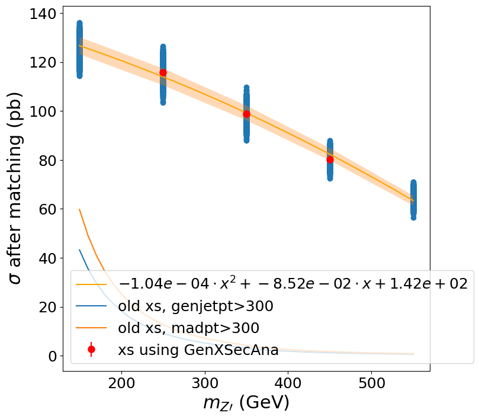

# Boosted SVJ cross sections with the MadPT patch

This repo analyzes the job logs from the signal generation. MadGraph reports the cross section at the end of LHE-format event generation as follows:

```
...
Begin processing the 500th record. Run 1, Event 80000, LumiSection 1 on stream 0 at 25-Oct-2022 05:05:00.963 MSK

 *-------  PYTHIA Event and Cross Section Statistics  -------------------------------------------------------------*
 |                                                                                                                 |
 | Subprocess                                    Code |            Number of events       |      sigma +- delta    |
 |                                                    |       Tried   Selected   Accepted |     (estimated) (mb)   |
 |                                                    |                                   |                        |
 |-----------------------------------------------------------------------------------------------------------------|
 |                                                    |                                   |                        |
 | Les Houches User Process(es)                  9999 |         500        500        357 |   9.625e-08  0.000e+00 |
 |    ... whereof user classification code          2 |         307        307        237 |                        | 
 |    ... whereof user classification code          3 |         193        193        120 |                        | 
 |                                                    |                                   |                        |
 | sum                                                |         500        500        357 |   9.625e-08  0.000e+00 |
 |                                                                                                                 |
 *-------  End PYTHIA Event and Cross Section Statistics ----------------------------------------------------------*

 *-------  PYTHIA Error and Warning Messages Statistics  ----------------------------------------------------------* 
 |                                                                                                                 | 
 |  times   message                                                                                                | 
 |                                                                                                                 | 
 |    143   Abort from Pythia::next: reached end of Les Houches Events File                                        | 
 |      2   Error in BeamRemnants::setKinematics: kinematics construction failed                                   | 
 |      2   Error in MiniStringFragmentation::fragment: no 1- or 2-body state found above mass threshold           | 
 |      2   Error in Pythia::next: hadronLevel failed; try again                                                   | 
 |      1   Info from SLHAinterface::initSLHA: No MODSEL found, keeping internal SUSY switched off                 | 
 |      1   Info from SLHAinterface::initSLHA: importing MASS entries                                              | 
 |      2   Warning in SLHAinterface::initSLHA: ignoring DECAY tables                                              | 
 |      2   Warning in SLHAinterface::initSLHA: ignoring MASS entries                                              | 
 |      3   Warning in SLHAinterface::initSLHA: ignoring QNUMBERS                                                  | 
 |      1   Warning in SLHAinterface::initSLHA: ignoring empty DECAY tables                                        | 
 |  36193   Warning in SimpleSpaceShower::pT2nextQCD: small daughter PDF                                           | 
 |      1   Warning in SimpleTimeShower: reject denom for iWeight =                                                | 
 |      2   Warning in SimpleTimeShower::init: Hidden Valley                                                       | 
 |      2   Warning in StringFragmentation::fragmentToJunction: bad convergence junction rest frame                | 
 |     21   Warning in TauDecays::decay: unknown correlated tau production, assuming from unpolarized photon       | 
 |                                                                                                                 | 
 *-------  End PYTHIA Error and Warning Messages Statistics  ------------------------------------------------------* 
25-Oct-2022 05:05:03 MSK  Closed LHE file thread0/cmsgrid_final.lhe
        48.562         0.930       150.843             3
        86.247         1.507       150.843             2
 

------------------------------------
GenXsecAnalyzer:
------------------------------------
-------------------------------------------------------------------------------------------------------------------------------------------------------------------------- 
Overall cross-section summary 
--------------------------------------------------------------------------------------------------------------------------------------------------------------------------
Process        xsec_before [pb]        passed    nposw    nnegw    tried    nposw    nnegw     xsec_match [pb]            accepted [%]     event_eff [%]
0        8.625e+01 +/- 1.507e+00        237    237    0    307    307    0    6.658e+01 +/- 2.370e+00        77.2 +/- 2.4    77.2 +/- 2.4
1        4.856e+01 +/- 9.301e-01        120    120    0    193    193    0    3.019e+01 +/- 1.791e+00        62.2 +/- 3.5    62.2 +/- 3.5
-------------------------------------------------------------------------------------------------------------------------------------------------------------------------- 
Total        1.348e+02 +/- 1.771e+00        357    357    0    500    500    0    9.625e+01 +/- 3.003e+00        71.4 +/- 2.0    71.4 +/- 2.0
--------------------------------------------------------------------------------------------------------------------------------------------------------------------------
Before matching: total cross section = 1.348e+02 +- 1.771e+00 pb
After matching: total cross section = 9.625e+01 +- 3.003e+00 pb
Matching efficiency = 0.7 +/- 0.0   [TO BE USED IN MCM]
Filter efficiency (taking into account weights)= (27770.7) / (48126.8) = 5.770e-01 +- 2.615e-02
Filter efficiency (event-level)= (206) / (357) = 5.770e-01 +- 2.615e-02    [TO BE USED IN MCM]

After filter: final cross section = 5.554e+01 +- 3.056e+00 pb
After filter: final fraction of events with negative weights = 0.000e+00 +- 0.000e+00
After filter: final equivalent lumi for 1M events (1/fb) = 1.800e+01 +- 9.907e-01
```

The 'filter' in question is the Z2 symmetry filter. For our cross section numbers we are using the following line:

```
After matching: total cross section = 9.625e+01 +- 3.003e+00 pb
```

## Download the job logs

```
mkdir logs
cd logs
xrdcp xrdcp root://cmseos.fnal.gov//store/user/lpcdarkqcd/boosted/madpteff/madptsignal_joblogs.tar.gz .
tar xvf madptsignal_joblogs.tar.gz
rm madptsignal_joblogs.tar.gz
```

## Run the fit

```
python -m venv env
source env/bin/activate
pip install numpy matplotlib

python madpt_eff.py
```

## Latest fit result


